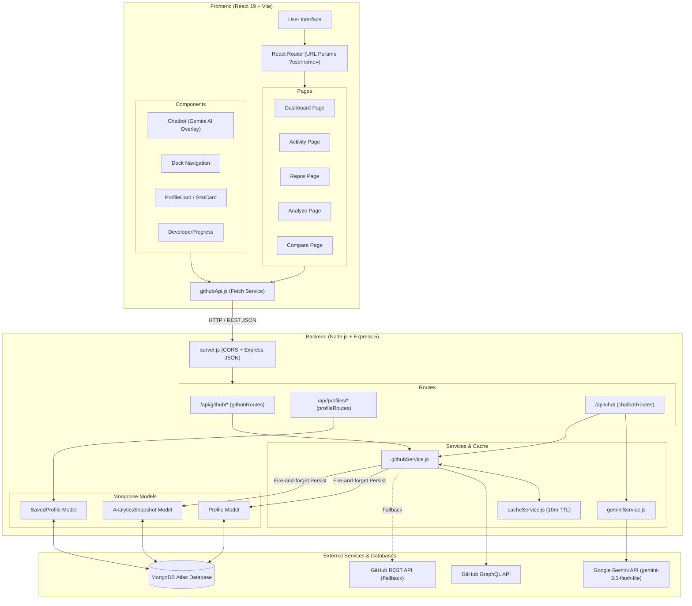

# PROJECT DOCUMENTATION — GitHub Analyzer V2.0

> **Last audited:** 2026-08-30  
> **Repository:** https://github.com/Saksham-2006/Github-Analyser-V2.0  
> **Status:** Working MVP / Hackathon-ready

---

## Table of Contents

1. [Project Overview](#1-project-overview)
2. [Complete Project Structure](#2-complete-project-structure)
3. [Frontend Architecture](#3-frontend-architecture)
4. [Frontend Component Details](#4-frontend-component-details)
5. [Routing](#5-routing)
6. [Backend Architecture](#6-backend-architecture)
7. [All API Endpoints](#7-all-api-endpoints)
8. [GitHub API Data Flow](#8-github-api-data-flow)
9. [Analytics Calculations](#9-analytics-calculations)
10. [MongoDB Database](#10-mongodb-database)
11. [Database Data Flow](#11-database-data-flow)
12. [Chatbot / Gemini](#12-chatbot--gemini)
13. [Environment Variables](#13-environment-variables)
14. [CORS](#14-cors)
15. [Deployment](#15-deployment)
16. [Complete User Journey](#16-complete-user-journey)
17. [Request/Response Flow Diagrams](#17-requestresponse-flow-diagrams)
18. [Error Handling](#18-error-handling)
19. [Caching / Rate Limiting](#19-caching--rate-limiting)
20. [Security](#20-security)
21. [Known Issues / Limitations](#21-known-issues--limitations)
22. [File-to-Feature Map](#22-file-to-feature-map)
23. [End-to-End Example](#23-end-to-end-example)
24. [Final Architecture Summary](#24-final-architecture-summary)

---

## 1. Project Overview

### What is GitHub Analyzer?

GitHub Analyzer is a full-stack web application that fetches, analyzes, and visualizes real GitHub developer data. Users enter a public GitHub username and receive a rich dashboard of statistics, contribution patterns, language distributions, coding streaks, and repository details — all derived from live GitHub API data.

### Main Purpose

Transform raw GitHub API data into meaningful developer insights with visualizations, comparisons, historical tracking, and AI-powered chat assistance.

### Main User Workflow

1. User visits the **Analyze** page and enters a GitHub username.
2. The backend fetches the user's data from the **GitHub GraphQL API** (with REST fallback).
3. Analytics (streaks, language percentages, activity trends) are calculated server-side.
4. A **Profile** and **AnalyticsSnapshot** are persisted to **MongoDB**.
5. The frontend renders a **Dashboard** with profile card, stat cards, language chart, recent activity, contribution grid, and developer progress.
6. The user can navigate to **Activity**, **Repos**, **Compare**, and use the **AI Chatbot**.

### Technology Stack

| Layer       | Technology                                                                 |
|-------------|---------------------------------------------------------------------------|
| Frontend    | React 19, Vite 8, Tailwind CSS 4, Recharts 3, Motion (Framer), Lucide    |
| Backend     | Node.js, Express 5, Mongoose 9                                           |
| Database    | MongoDB Atlas (via Mongoose)                                              |
| External    | GitHub GraphQL API, GitHub REST API, Google Gemini AI (`gemini-3.5-flash-lite`) |
| Dev Tools   | Nodemon, OxLint, concurrently                                            |

### Architecture Diagram



---

## 2. Complete Project Structure

```
Prototype/                          # Project root
├── package.json                    # Root: concurrently to run both servers
├── netlify.toml                    # Netlify build config for frontend
├── .gitignore                      # Ignores node_modules, .env, dist
├── README.md                       # Project README
│
├── app/                            # ── FRONTEND (React + Vite) ──
│   ├── package.json                # Frontend dependencies
│   ├── vite.config.js              # Vite config with React + Tailwind plugins
│   ├── index.html                  # HTML entry (title: "Github Analytics")
│   ├── .env.example                # VITE_API_URL=http://localhost:5000
│   ├── .env.local                  # Actual env (gitignored)
│   ├── public/                     # Static assets
│   └── src/
│       ├── main.jsx                # React entry: BrowserRouter wrapping App
│       ├── App.jsx                 # Route definitions + Chatbot overlay
│       ├── index.css               # Global CSS: dark bg, scrollbar, chatbot markdown
│       ├── assets/
│       │   └── github.svg          # GitHub logo icon
│       ├── layouts/
│       │   └── AppLayout.jsx       # Outlet + Dock navigation
│       ├── pages/
│       │   ├── Dashboard.jsx       # Main dashboard (demo + real)
│       │   ├── Activity.jsx        # Activity analytics page
│       │   ├── Repos.jsx           # Repositories list page
│       │   ├── Analyze.jsx         # Username entry + saved profiles
│       │   └── Compare.jsx         # Side-by-side comparison + radar chart
│       ├── components/
│       │   ├── ActivityByWeek/     # Bar chart: weekly commits
│       │   ├── Chatbot/            # Floating AI chatbot
│       │   ├── CommitActivityChart/ # Line chart: monthly commits
│       │   ├── ContributionGrid/   # GitHub-style contribution heatmap
│       │   ├── DeveloperProgress/  # Delta comparison between snapshots
│       │   ├── Dock/               # macOS-style bottom dock navigation
│       │   ├── FeatureCard/        # Feature highlight cards on Analyze page
│       │   ├── GitHubSearch/       # Username input with validation
│       │   ├── LanguageChart/      # Horizontal bar chart of languages
│       │   ├── Loader/             # Primary loading animation
│       │   ├── Loader2/            # Secondary loading animation
│       │   ├── Loadre3/            # Tertiary loading animation (typo in name)
│       │   ├── MostActiveDays/     # Bar chart: commits by day of week
│       │   ├── Nav/                # Top navigation bar
│       │   ├── Pattern/            # Decorative SVG pattern
│       │   ├── ProfileCard/        # User profile card with save/unsave
│       │   ├── RecentActivity/     # Line chart: last 7 days
│       │   ├── RepoStats/          # 4x StatCard grid for repo page
│       │   ├── RepositoryCard/     # Individual repository card
│       │   ├── RepositorySearch/   # Search + sort controls for repos
│       │   ├── StatCard/           # Reusable stat display card
│       │   └── TrueFocus/          # Animated text focus effect
│       └── services/
│           └── githubApi.js        # All frontend API fetch functions
│
└── server/                         # ── BACKEND (Express) ──
    ├── package.json                # Backend dependencies
    ├── server.js                   # Express entry: CORS, routes, listen
    ├── .env                        # Actual secrets (gitignored)
    ├── .env.example                # Template with placeholder values
    ├── config/
    │   └── db.js                   # MongoDB connection (graceful failure)
    ├── models/
    │   ├── Profile.js              # Mongoose: GitHub profile data
    │   ├── AnalyticsSnapshot.js    # Mongoose: point-in-time analytics
    │   └── SavedProfile.js         # Mongoose: user-bookmarked profiles
    ├── routes/
    │   ├── githubRoutes.js         # /api/github/* endpoints
    │   ├── profileRoutes.js        # /api/profiles/* endpoints
    │   └── chatbotRoutes.js        # /api/chat endpoint
    └── services/
        ├── githubService.js        # GitHub data fetching + analytics
        ├── cacheService.js         # In-memory TTL cache
        └── geminiService.js        # Google Gemini AI integration
```

---

## 3. Frontend Architecture

### Entry Point

**`app/src/main.jsx`** renders `<App />` inside `<BrowserRouter>` and `<StrictMode>`, importing global CSS from `index.css`.

### App.jsx

**`app/src/App.jsx`** defines all routes wrapped in `<AppLayout>` (which provides the Dock navigation) and renders `<Chatbot />` as a global overlay outside of routes.

```jsx
<Routes>
  <Route element={<AppLayout />}>
    <Route path="/" element={<Dashboard />} />
    <Route path="/activity" element={<Activity />} />
    <Route path="/repos" element={<Repos />} />
    <Route path="/analyze" element={<Analyze />} />
    <Route path="/compare" element={<Compare />} />
  </Route>
</Routes>
<Chatbot />
```

### Pages

#### Dashboard (`/`)
- **File:** `app/src/pages/Dashboard.jsx`
- **Purpose:** Main dashboard view. Shows demo data when no `?username=` param; shows real GitHub data when param is present.
- **API call:** `fetchUserDashboard(username)` → `GET /api/github/:username/dashboard?fresh=true`
- **Components used:** Nav, Loader, ProfileCard, StatCard (×4), DeveloperProgress, LanguageChart, RecentActivity, ContributionGrid
- **Demo data:** Hardcoded `demoUser`, `demoStats`, `demoLanguages`, `demoActivity`, `demoContributions` objects.

#### Activity (`/activity`)
- **File:** `app/src/pages/Activity.jsx`
- **Purpose:** Detailed contribution analytics.
- **API call:** `fetchUserDashboard(username)` → same dashboard endpoint (reuses the full bundle).
- **Components used:** Nav, StatCard (×4), ContributionGrid, CommitActivityChart, MostActiveDays, ActivityByWeek, Loader, Loader2
- **Demo data:** Hardcoded `demoStats`, `demoContributions`, `demoCommitData`, `demoActiveDays`, `demoWeeklyActivity`.

#### Repos (`/repos`)
- **File:** `app/src/pages/Repos.jsx`
- **Purpose:** Repository listing with search, sort, and language filter.
- **API calls:** `fetchUserRepositories(username)` + `fetchUserProfile(username)` concurrently.
- **Components used:** Nav, RepoStats, RepositorySearch, RepositoryCard, Pattern, Loader
- **Client-side state:** `search`, `sortBy` (stars/forks/updated/created/name), `language` (dropdown filter), `visibleCount` (load-more pagination).
- **Demo data:** 6 hardcoded `demoRepositories` objects.

#### Analyze (`/analyze`)
- **File:** `app/src/pages/Analyze.jsx`
- **Purpose:** Entry point for analyzing a username. Also displays saved profiles.
- **API calls:** `fetchSavedProfiles()` on mount; `deleteSavedProfile(username)` on removal.
- **Components used:** Nav, GitHubSearch, FeatureCard (×4), TrueFocus, Loader3, Bookmark icons
- **Navigation:** When a user clicks "Analyze" on a saved profile, navigates to `/?username=<username>`.

#### Compare (`/compare`)
- **File:** `app/src/pages/Compare.jsx`
- **Purpose:** Side-by-side comparison of two GitHub developers.
- **API calls:** `compareUsers(user1, user2)` → `GET /api/github/compare/:u1/:u2?fresh=true`; `fetchSavedProfiles()` for optional dropdown.
- **Components used:** Nav, Loader, Recharts RadarChart, custom MetricRow component.
- **Features:** Input form for two usernames, optional saved profile dropdowns, comparison statistics table, language comparison, performance radar chart (spider chart).
- **Radar chart:** Normalizes all 9 metrics to 0–100 scale based on the higher value. Custom tooltip shows raw values.

### Services

**`app/src/services/githubApi.js`** — All API communication centralized here.

| Function | Endpoint | Method |
|----------|----------|--------|
| `fetchUserProfile(username)` | `/api/github/:username` | GET |
| `fetchUserDashboard(username)` | `/api/github/:username/dashboard?fresh=true` | GET |
| `fetchUserRepositories(username)` | `/api/github/:username/repos` | GET |
| `fetchUserActivity(username)` | `/api/github/:username/activity` | GET |
| `fetchUserHistory(username)` | `/api/github/:username/history` | GET |
| `saveProfile(profileData)` | `/api/profiles/save` | POST |
| `fetchSavedProfiles()` | `/api/profiles/saved` | GET |
| `deleteSavedProfile(username)` | `/api/profiles/saved/:username` | DELETE |
| `compareUsers(u1, u2)` | `/api/github/compare/:u1/:u2?fresh=true` | GET |

All functions use a shared `handleResponse()` that extracts `data.data` on success and throws descriptive errors on failure.

### State Management

No global state management library is used. Each page uses local `useState` + `useEffect` to fetch data on mount/param change. The `username` query parameter in the URL is the primary mechanism for passing context between pages.

### Styling

- **Tailwind CSS v4** via `@tailwindcss/vite` plugin.
- **Design tokens:** Dark background `#0f0f0f`, purple accent `#5227FF` / `oklch(51.1% 0.262 276.966)`, neutral borders `border-neutral-700`.
- **Custom CSS:** `index.css` contains global scrollbar styling and `.chatbot-markdown` styles for rendering AI responses.

---

## 4. Frontend Component Details

### Nav (`components/Nav/Nav.jsx`)
- **Props:** `{ user }` — optional user object with `name` and `login`.
- **Renders:** GitHub logo + "GITHUB ANALYTICS" title + display name (falls back to "The Octocat").
- **No state, no API calls.**

### ProfileCard (`components/ProfileCard/ProfileCard.jsx`)
- **Props:** `{ user }` — GitHub profile object.
- **State:** `saveState` — `"idle"` | `"saving"` | `"saved"`.
- **On mount:** Calls `fetchSavedProfiles()` to check if profile is already saved.
- **Actions:** "Save Profile" button calls `saveProfile()`, "Unsave" calls `deleteSavedProfile()`.
- **Displays:** Avatar, name, @login, bio, public_repos, followers, following, "View GitHub" link.

### StatCard (`components/StatCard/StatCard.jsx`)
- **Props:** `{ title, value, description, icon, className }`.
- **Pure display component.** No state, no API calls.

### LanguageChart (`components/LanguageChart/LanguageChart.jsx`)
- **Props:** `{ data }` — array of `{ language, percentage }`.
- **Uses:** Recharts `BarChart` (vertical layout), purple bars.
- **Empty state:** "No language data available."

### RecentActivity (`components/RecentActivity/RecentActivity.jsx`)
- **Props:** `{ data }` — array of `{ day, commits }` (last 7 days).
- **Uses:** Recharts `LineChart` with purple stroke.

### ContributionGrid (`components/ContributionGrid/ContributionGrid.jsx`)
- **Props:** `{ data, weeks = 20 }` — array of `{ date, count }`.
- **Uses:** `useMemo` to build a 2D grid (weeks × 7 days). Color levels: `bg-white/5` (0), `bg-indigo-950` (1–2), `bg-indigo-800` (3–5), `bg-indigo-600` (6–10), `bg-indigo-400` (11+).
- **Legend:** Less → More with color swatches.

### DeveloperProgress (`components/DeveloperProgress/DeveloperProgress.jsx`)
- **Props:** `{ username }`.
- **API call:** `fetchUserHistory(username)` on mount.
- **Logic:** Requires ≥2 snapshots. Compares `history[0]` (newest) vs `history[1]` (second newest). Displays delta for repositories, stars, forks, commits.
- **Delta component:** Shows `+N` (green), `-N` (red), or `±0` (gray).

### CommitActivityChart (`components/CommitActivityChart/CommitActivityChart.jsx`)
- **Props:** `{ data }` — array of `{ month, commits }`.
- **Uses:** Recharts `LineChart`. Displays monthly commit trends.

### MostActiveDays (`components/MostActiveDays/MostActiveDays.jsx`)
- **Props:** `{ data }` — array of `{ day, commits }` (Monday–Sunday).
- **Uses:** Recharts `BarChart` (horizontal). Shows total commits per weekday.

### ActivityByWeek (`components/ActivityByWeek/ActivityByWeek.jsx`)
- **Props:** `{ data }` — array of `{ week, commits }` (W1–W8).
- **Uses:** Recharts `BarChart` (vertical). Shows weekly commit totals.

### GitHubSearch (`components/GitHubSearch/GitHubSearch.jsx`)
- **State:** `username`, `loading`, `error`.
- **On submit:** Calls `fetchUserProfile(username)` to validate the username exists. On success, navigates to `/?username=<login>`.
- **Error display:** Shows red error message below input.

### RepositoryCard (`components/RepositoryCard/RepositoryCard.jsx`)
- **Props:** `{ repo }` — repository object.
- **Displays:** Name, description, language (with purple dot), stars, forks, topics (max 3), "Updated" time, external link to GitHub.

### RepositorySearch (`components/RepositorySearch/RepositorySearch.jsx`)
- **Props:** `{ search, setSearch, sortBy, setSortBy }`.
- **Controlled inputs:** Text search with clear button, sort dropdown (stars/forks/updated/created/name).

### RepoStats (`components/RepoStats/RepoStats.jsx`)
- **Props:** `{ stats }` — `{ repositories, stars, forks, languages }`.
- **Renders:** 4 × StatCard with icons.

### Dock (`components/Dock/Dock.jsx`)
- **Props:** `{ items, spring, magnification, distance, panelHeight, dockHeight, baseItemSize }`.
- **macOS-style animated dock** using Framer Motion (`motion/react`).
- **Features:** Mouse-proximity magnification, animated labels on hover, keyboard accessibility.
- **Items:** Configured in `AppLayout.jsx` — Dashboard, Activity, Analyze, Repos, Compare.

### Chatbot (`components/Chatbot/Chatbot.jsx`)
- **State:** `isOpen`, `message`, `loading`, `messages` array, `savedProfiles`.
- **API call:** `POST /api/chat` with `{ message, username }` (username extracted from URL `?username=`).
- **Quick questions:** 6 pre-built questions shown as tappable chips after every response.
- **Rendering:** User messages in purple bubbles. Assistant messages rendered with `react-markdown` and styled via `.chatbot-markdown` CSS class.
- **Floating button:** Fixed bottom-right, toggles chat window.

### FeatureCard (`components/FeatureCard/FeatureCard.jsx`)
- **Props:** `{ icon, title, description, color }`.
- **Used on:** Analyze page. Displays feature highlights (Activity, Languages, Streaks, Repositories).

---

## 5. Routing

### Complete Routing Table

| Route | Component | Purpose | Query Params | API Calls |
|-------|-----------|---------|--------------|-----------|
| `/` | Dashboard | Main dashboard (demo or real data) | `?username=<string>` | `GET /api/github/:username/dashboard` |
| `/activity` | Activity | Contribution analytics | `?username=<string>` | `GET /api/github/:username/dashboard` |
| `/repos` | Repos | Repository listing | `?username=<string>` | `GET /api/github/:username/repos` + `GET /api/github/:username` |
| `/analyze` | Analyze | Username entry + saved profiles | none | `GET /api/profiles/saved` |
| `/compare` | Compare | Two-developer comparison | `?user1=<string>&user2=<string>` | `GET /api/github/compare/:u1/:u2` + `GET /api/profiles/saved` |

### Username Data Flow

```
User types "octocat" on Analyze page
  → GitHubSearch.handleSubmit()
  → fetchUserProfile("octocat") → GET /api/github/octocat
  → On success: navigate("/?username=octocat")
  → URL updates to /?username=octocat
  → Dashboard component reads searchParams.get("username")
  → useEffect triggers fetchUserDashboard("octocat")
  → GET /api/github/octocat/dashboard?fresh=true
  → Express → githubRoutes.js → getDashboard("octocat")
  → githubService.js → getFullUserData("octocat")
  → GitHub GraphQL API
  → Response parsed → analytics calculated → cache set
  → persistSnapshot(dashboardData) → MongoDB upsert
  → JSON response → frontend setRealDashboard(data)
  → isReal = true → components render real data
  → Dock preserves ?username= in navigation links
```

---

## 6. Backend Architecture

### server.js Execution Order

1. `require("dotenv").config()` — loads `.env` variables.
2. Import route modules: `githubRoutes`, `profileRoutes`, `chatbotRoutes`.
3. `connectDB()` — attempts MongoDB connection; logs warning on failure (does NOT exit).
4. Configure CORS middleware with allowed origins.
5. `express.json()` middleware.
6. Mount routes: `/api/github`, `/api/profiles`, `/api/chat`.
7. Health check: `GET /` returns `{ message: "GitHub Analyzer API is running" }`.
8. `app.listen(PORT)` — defaults to 5000.

### Middleware Order

1. **CORS** — origin whitelist check.
2. **express.json()** — parses JSON request bodies.
3. **Route handlers** — each route file handles its own async errors.

### Error Handling Pattern

The `errorHandler(res, error)` function in `githubRoutes.js` standardizes error responses:
- 403/RATE_LIMITED → "GitHub API rate limit reached."
- 404/NOT_FOUND → "GitHub user not found."
- Other → generic message with original error status.

---

## 7. All API Endpoints

### GitHub Routes (`/api/github`)

---

#### `GET /api/github/:username`

- **Purpose:** Get basic user profile.
- **Service:** `getUser(username)` → `getFullUserData(username)` → returns `bundle.profile`.
- **Response:** `{ success: true, data: { login, name, avatar_url, bio, public_repos, followers, following, html_url, location, created_at } }`
- **Used by:** `GitHubSearch` component (for username validation), `Repos` page.

---

#### `GET /api/github/:username/dashboard?fresh=true`

- **Purpose:** Full dashboard payload with profile, stats, languages, activity, contributions.
- **Service:** `getDashboard(username, forceRefresh)`.
- **Side effect:** Calls `persistSnapshot(dashboardData)` (non-blocking MongoDB write).
- **Response:**
```json
{
  "success": true,
  "data": {
    "profile": { "id", "login", "name", "avatar_url", "bio", ... },
    "stats": { "repositories", "totalStars", "totalForks", "totalCommits", "currentStreak", "longestStreak", "languageCount" },
    "languages": [{ "language", "percentage", "bytes" }],
    "recentActivity": [{ "day", "commits", "date" }],
    "contributions": [{ "date", "count" }],
    "activity": {
      "commitActivity": [{ "month", "commits" }],
      "mostActiveDays": [{ "day", "commits" }],
      "activityByWeek": [{ "week", "commits" }]
    }
  }
}
```
- **Used by:** Dashboard, Activity pages.

---

#### `GET /api/github/:username/repos`

- **Purpose:** Repository list + aggregate stats.
- **Service:** `getRepositories(username)`.
- **Response:**
```json
{
  "success": true,
  "data": {
    "repositories": [{ "id", "name", "description", "language", "stargazers_count", "forks_count", "html_url", "updated_at", "updated", "created_at", "topics", "isFork" }],
    "stats": { "repositories", "stars", "forks", "languages" }
  }
}
```
- **Used by:** Repos page.

---

#### `GET /api/github/:username/activity`

- **Purpose:** Activity-specific data.
- **Service:** `getActivity(username)`.
- **Response:** `{ stats, contributions, commitActivity, mostActiveDays, activityByWeek }`
- **Note:** Not currently called by the frontend. The Activity page uses `fetchUserDashboard` instead, which returns the same data.

---

#### `GET /api/github/:username/history`

- **Purpose:** Analytics history (newest first, max 30).
- **Database:** Queries `Profile` by username, then `AnalyticsSnapshot` by `profileId`.
- **Response:** Array of `{ date, repositories, stars, forks, commits, currentStreak, longestStreak, languageCount, languages, createdAt }`.
- **Used by:** `DeveloperProgress` component.

---

#### `GET /api/github/compare/:username1/:username2`

- **Purpose:** Compare two developers.
- **Service:** Calls `getDashboard()` for both users concurrently via `Promise.all`.
- **Side effect:** `persistSnapshot()` for both users.
- **Response:**
```json
{
  "success": true,
  "data": {
    "user1": { "profile", "stats", "languages", "recentActivity", "contributions", "activity" },
    "user2": { "profile", "stats", "languages", "recentActivity", "contributions", "activity" }
  }
}
```
- **Used by:** Compare page.

---

### Profile Routes (`/api/profiles`)

---

#### `POST /api/profiles/save`

- **Purpose:** Save/bookmark a profile.
- **Body:** `{ username, githubId, name, avatarUrl, profileUrl }`
- **Database:** `SavedProfile.findOneAndUpdate()` upsert by lowercase username.
- **Used by:** ProfileCard "Save" button.

---

#### `GET /api/profiles/saved`

- **Purpose:** List all saved profiles (newest first).
- **Database:** `SavedProfile.find().sort({ createdAt: -1 })`.
- **Used by:** Analyze page, Compare page (dropdown selectors).

---

#### `DELETE /api/profiles/saved/:username`

- **Purpose:** Remove a saved profile.
- **Database:** `SavedProfile.deleteOne({ username })`.
- **Used by:** Analyze page (X button), ProfileCard "Unsave" button.

---

### Chat Routes (`/api/chat`)

---

#### `POST /api/chat`

- **Purpose:** Send message to Gemini AI.
- **Body:** `{ message, username }` — username is optional.
- **Flow:** If `username` is present, calls `getDashboard(username, false)` to fetch GitHub context. Passes context + message to `generateChatResponse()`.
- **Response:** `{ success: true, data: { reply: "..." } }`
- **Used by:** Chatbot component.

---

## 8. GitHub API Data Flow

### Primary Path: GraphQL API

**File:** `server/services/githubService.js` → `fetchGraphQLData(username)`

**GitHub endpoint:** `POST https://api.github.com/graphql`

**Headers:**
```
Authorization: Bearer <GITHUB_TOKEN>
Accept: application/vnd.github+json
User-Agent: GitHub-Analyzer
X-GitHub-Api-Version: 2022-11-28
Content-Type: application/json
```

**GraphQL query fields used:**

| Field | Maps to |
|-------|---------|
| `user.databaseId` | `profile.id` (used for MongoDB upsert) |
| `user.login` | `profile.login` |
| `user.name` | `profile.name` |
| `user.avatarUrl` | `profile.avatar_url` |
| `user.bio` | `profile.bio` |
| `user.location` | `profile.location` |
| `user.url` | `profile.html_url` |
| `user.createdAt` | `profile.created_at` |
| `user.followers.totalCount` | `profile.followers` |
| `user.following.totalCount` | `profile.following` |
| `user.repositories.totalCount` | `profile.public_repos` |
| `user.repositories.nodes[].stargazerCount` | `repo.stargazers_count` |
| `user.repositories.nodes[].forkCount` | `repo.forks_count` |
| `user.repositories.nodes[].primaryLanguage.name` | `repo.language` |
| `user.repositories.nodes[].languages.edges[]` | Language byte aggregation |
| `user.contributionsCollection.contributionCalendar.weeks[].contributionDays[]` | Daily contribution data |
| `user.contributionsCollection.totalCommitContributions` | Not directly used (uses calendar total instead) |

**Repository limit:** `first: 100` — only the 100 most recently updated repositories are fetched.

### Fallback Path: REST API

If GraphQL fails (network error, not auth/rate errors), falls back to `fetchRestUser(username)`:

**Endpoint:** `GET https://api.github.com/users/:username`

**Limitation:** REST fallback provides only profile data. Stats default to 0, languages to empty, contributions to empty 140-day array.

---

## 9. Analytics Calculations

### Repositories
- **Source:** `rawUser.repositories.totalCount` from GraphQL.
- **Storage:** `stats.repositories` in response; `AnalyticsSnapshot.repositories` in MongoDB.
- **UI:** StatCard on Dashboard and Activity pages.

### Stars (totalStars)
- **Calculation:** `repos.reduce((sum, r) => sum + r.stargazers_count, 0)` — summed from all fetched repos (max 100).
- **Limitation:** Only covers the 100 most recently updated repos. Users with 100+ repos may have inaccurate star counts.

### Forks (totalForks)
- **Calculation:** Same pattern as stars: `repos.reduce((sum, r) => sum + r.forks_count, 0)`.
- **Same 100-repo limitation.**

### Followers / Following
- **Source:** Direct from GraphQL `totalCount` fields. Reliable.

### Languages
- **Calculation:** Aggregates `languages.edges[].size` (bytes) across all repos. Calculates percentage as `(bytes / totalBytes) * 100`, rounded to 1 decimal. Top 8 languages returned.
- **Fallback:** If no byte data, counts repos per primary language and calculates percentage by repo count.

### Total Commits (totalContributions)
- **Source:** `contributionsCollection.contributionCalendar.totalContributions` from GraphQL.
- **Note:** This counts all contributions (commits, issues, PRs, reviews) in the last year, not lifetime commits.

### Current Streak
- **Calculation:** `calculateStreaks(allDays)` in `githubService.js`.
- Walking backward from the last day (or yesterday if today has 0 contributions), counting consecutive days with `count > 0`.
- **Data source:** Only covers the contribution calendar period (≈1 year).

### Longest Streak
- **Calculation:** Forward pass through all days, tracking the longest consecutive run of `count > 0`.
- **Same 1-year limitation.**

### Contribution Grid Data
- **Source:** `contributionsCollection.contributionCalendar.weeks[].contributionDays[]`.
- **Transform:** Flattened to `[{ date, count }]`. Last 140 days (20 weeks) returned for the grid.

### Activity Trends (computed in `computeActivityTrends(days)`)

| Metric | Calculation |
|--------|------------|
| `recentActivity` | Last 7 days with day name (Mon–Sun) |
| `mostActiveDays` | Sum of all contributions grouped by weekday |
| `activityByWeek` | Last 8 weeks, each summed |
| `commitActivity` | Last 8 months, each summed |

### Demo/Hardcoded Data Locations

| Page | File | Variables |
|------|------|-----------|
| Dashboard | `Dashboard.jsx` | `demoUser`, `demoStats`, `demoLanguages`, `demoActivity`, `demoContributions` |
| Activity | `Activity.jsx` | `demoStats`, `demoContributions`, `demoCommitData`, `demoActiveDays`, `demoWeeklyActivity` |
| Repos | `Repos.jsx` | `demoRepositories` (6 hardcoded repos), `demoStats` |

All demo data uses static values (no `Math.random()`). Demo data is only shown when no `?username=` param is present.

---

## 10. MongoDB Database

### Connection

**File:** `server/config/db.js`

- Uses `mongoose.connect(process.env.MONGODB_URI)`.
- On failure: logs warning, does NOT crash the server (`process.exit(1)` was removed).

### Profile Model

**File:** `server/models/Profile.js`

| Field | Type | Required | Unique | Index |
|-------|------|----------|--------|-------|
| `githubId` | Number | ✅ | ✅ | implicit |
| `username` | String | ✅ | ✅ | ✅ |
| `name` | String | ❌ | ❌ | ❌ |
| `avatarUrl` | String | ❌ | ❌ | ❌ |
| `bio` | String | ❌ | ❌ | ❌ |
| `location` | String | ❌ | ❌ | ❌ |
| `profileUrl` | String | ❌ | ❌ | ❌ |
| `publicRepos` | Number | ❌ | ❌ | ❌ |
| `followers` | Number | ❌ | ❌ | ❌ |
| `following` | Number | ❌ | ❌ | ❌ |
| `createdAt` | Date | auto | ❌ | ❌ |
| `updatedAt` | Date | auto | ❌ | ❌ |

### AnalyticsSnapshot Model

**File:** `server/models/AnalyticsSnapshot.js`

| Field | Type | Required | Default |
|-------|------|----------|---------|
| `profileId` | ObjectId (ref: Profile) | ✅ | — |
| `repositories` | Number | ❌ | 0 |
| `totalStars` | Number | ❌ | 0 |
| `totalForks` | Number | ❌ | 0 |
| `languageCount` | Number | ❌ | 0 |
| `totalCommits` | Number | ❌ | 0 |
| `currentStreak` | Number | ❌ | 0 |
| `longestStreak` | Number | ❌ | 0 |
| `languages` | Array of `{ language: String, percentage: Number }` | ❌ | [] |
| `createdAt` | Date | auto | — |
| `updatedAt` | Date | auto | — |

### SavedProfile Model

**File:** `server/models/SavedProfile.js`

| Field | Type | Required | Unique | Properties |
|-------|------|----------|--------|------------|
| `username` | String | ✅ | ✅ | lowercase, trim, indexed |
| `githubId` | Number | ✅ | ❌ | — |
| `name` | String | ❌ | ❌ | default: "" |
| `avatarUrl` | String | ❌ | ❌ | default: "" |
| `profileUrl` | String | ❌ | ❌ | default: "" |
| `createdAt` | Date | auto | ❌ | — |
| `updatedAt` | Date | auto | ❌ | — |

---

## 11. Database Data Flow

### Profile + Snapshot Creation

```
GET /api/github/:username/dashboard
  → getDashboard(username)
  → Response sent to client immediately
  → persistSnapshot(dashboardData) runs fire-and-forget:
      1. Profile.findOneAndUpdate({ githubId }, {...}, { upsert: true })
         → Creates or updates Profile document
      2. AnalyticsSnapshot.findOne({ profileId }).sort({ createdAt: -1 })
         → Gets latest snapshot
      3. Compares all numeric fields to check for changes
      4. If data changed (or first time) → AnalyticsSnapshot.create({...})
         → Creates new point-in-time snapshot
      5. If data identical → skips (prevents spam)
```

### Profile History Read

```
GET /api/github/:username/history
  → Profile.findOne({ username })
  → AnalyticsSnapshot.find({ profileId }).sort({ createdAt: -1 }).limit(30)
  → Returns array of snapshots mapped to { date, repositories, stars, forks, commits, ... }
```

### Developer Progress Flow

```
DeveloperProgress component (username prop)
  → fetchUserHistory(username) → GET /api/github/:username/history
  → Receives array of snapshots
  → Requires ≥ 2 snapshots
  → current = history[0] (newest)
  → previous = history[1] (second newest)
  → Displays delta: current[metric] - previous[metric]
```

### Saved Profiles Flow

```
Save:
  ProfileCard → saveProfile({username, githubId, name, avatarUrl, profileUrl})
  → POST /api/profiles/save
  → SavedProfile.findOneAndUpdate({ username }, {...}, { upsert: true })

List:
  Analyze page / Compare page → fetchSavedProfiles()
  → GET /api/profiles/saved
  → SavedProfile.find().sort({ createdAt: -1 })

Delete:
  Analyze page / ProfileCard → deleteSavedProfile(username)
  → DELETE /api/profiles/saved/:username
  → SavedProfile.deleteOne({ username })
```

---

## 12. Chatbot / Gemini

### Architecture

```
Chatbot component (browser)
  → extracts username from URL: new URLSearchParams(window.location.search).get("username")
  → POST /api/chat { message: "...", username: "octocat" | null }
  → chatbotRoutes.js:
      → If username present: getDashboard(username, false) to get context
      → generateChatResponse(message, contextData)
  → geminiService.js:
      → If contextData exists, builds enriched prompt:
         "You are a helpful GitHub AI assistant. The user is currently viewing
          the GitHub profile of <login>. Here is their data: <JSON>
          User Question: <message>"
      → If no contextData, sends raw message
      → ai.models.generateContent({ model: "gemini-3.5-flash-lite", contents: prompt })
      → Returns response.text
  → Response → Chatbot → ReactMarkdown renders formatted answer
```

### Configuration

| Item | Value |
|------|-------|
| SDK | `@google/genai` v2.19.0 |
| Model | `gemini-3.5-flash-lite` |
| API Key | `process.env.GEMINI_API_KEY` (server-side only) |
| Context | GitHub profile data (profile, stats, languages) when username in URL |

### Error Handling

- Gemini errors are caught in `chatbotRoutes.js`, logged to console, and returned as `{ success: false, message: error.message }`.
- The chatbot component displays the error message in an assistant bubble.
- **No specific 429 (rate limit) handling** — treated as a generic error.

### Quick Questions

6 pre-built questions rendered as tappable chips after every response:

1. "How can I improve my GitHub account?"
2. "How do I make open source contributions?"
3. "How to grow my GitHub followers?"
4. "How to make killer Readme Design?"
5. "Pinned Repo Strategy"
6. "How to gain Stars?"

---

## 13. Environment Variables

| Variable | Used By | Purpose | Side | Required |
|----------|---------|---------|------|----------|
| `GITHUB_TOKEN` | `githubService.js` | GitHub API authentication (Bearer token) | Backend | Yes (for GraphQL) |
| `MONGODB_URI` | `config/db.js` | MongoDB Atlas connection string | Backend | Yes (for persistence) |
| `GEMINI_API_KEY` | `geminiService.js` | Google Gemini AI API key | Backend | Yes (for chatbot) |
| `FRONTEND_URL` | `server.js` | Additional CORS allowed origin | Backend | No |
| `PORT` | `server.js` | Server listen port (default: 5000) | Backend | No |
| `VITE_API_URL` | `githubApi.js`, `Chatbot.jsx` | Backend URL (default: `http://localhost:5000`) | Frontend | Yes |

---

## 14. CORS

**File:** `server/server.js`

**Allowed Origins:**
1. `http://localhost:5173` (Vite dev server)
2. `process.env.FRONTEND_URL` (configurable)
3. `https://github-analyser-rho.vercel.app` (hardcoded production URL)

**Behavior:**
- Requests with no `Origin` header (e.g., server-to-server, Postman) are allowed (`!origin` check).
- Blocked origins receive: `Error: CORS blocked: <origin>`.

---

## 15. Deployment

### Frontend (Netlify)

**Config:** `netlify.toml`
```
[build]
  base = "app"
  command = "npm run build"
  publish = "dist"

[build.environment]
  NODE_VERSION = "20"
```

**Production URL:** `https://github-analyser-rho.vercel.app` (referenced in CORS config — note: the URL says Vercel but the config is for Netlify; this is a naming inconsistency).

### Backend

- **No explicit deployment config found** in the repository for the backend.
- `.env.example` mentions "Render sets this automatically" for PORT, suggesting Render.com deployment.
- Start command: `node server.js` (from `package.json` scripts).

### Database

- MongoDB Atlas (cloud) based on the connection string format in `.env.example`: `mongodb+srv://`.

---

## 16. Complete User Journey

1. **User opens** `http://localhost:5173/` → Dashboard loads with **demo data**.
2. **User clicks** "Analyze" in the Dock → navigates to `/analyze`.
3. **Analyze page** shows GitHubSearch input, feature cards, and saved profiles list.
4. **User types** "octocat" and clicks "Analyze":
   - `fetchUserProfile("octocat")` validates the username.
   - On success → navigates to `/?username=octocat`.
5. **Dashboard** detects `?username=octocat`:
   - Shows Loader with "Analyzing @octocat..."
   - Calls `fetchUserDashboard("octocat")`.
   - Backend fetches from GitHub GraphQL, calculates analytics, persists to MongoDB.
   - Dashboard renders real profile, stats, languages, activity, contributions.
6. **DeveloperProgress** loads analytics history from MongoDB and shows deltas.
7. **User clicks** "Activity" in Dock → `/activity?username=octocat` → detailed charts.
8. **User clicks** "Repos" in Dock → `/repos?username=octocat` → repository list with search/sort/filter.
9. **User clicks** "Save Profile" on ProfileCard → `POST /api/profiles/save`.
10. **User clicks** "Compare" in Dock → `/compare` → enters two usernames or selects saved profiles → side-by-side comparison with radar chart.
11. **User clicks** chatbot FAB → floating chat window opens → can ask questions with GitHub context.

---

## 17. Request/Response Flow Diagrams

### A. Analyze Profile

```
GitHubSearch → fetchUserProfile("octocat")
  → GET /api/github/octocat
  → githubRoutes.js → getUser()
  → getFullUserData() → fetchGraphQLData()
  → GitHub GraphQL API
  ← profile data
  → cache.set()
  ← { success: true, data: profile }
  → navigate("/?username=octocat")
```

### B. Dashboard

```
Dashboard useEffect (username="octocat")
  → fetchUserDashboard("octocat")
  → GET /api/github/octocat/dashboard?fresh=true
  → githubRoutes.js → getDashboard()
  → getFullUserData(username, true)
  → fetchGraphQLData("octocat") → GitHub GraphQL
  ← raw user data
  → Calculate: profile, repos, languages, streaks, activity trends
  → cache.set(bundle, 600)
  → persistSnapshot(data) → MongoDB (fire-and-forget)
  ← { success: true, data: { profile, stats, languages, recentActivity, contributions, activity } }
  → setRealDashboard(data) → render components
```

### C. Activity

```
Activity useEffect (username="octocat")
  → fetchUserDashboard("octocat")  [reuses dashboard endpoint]
  → Same flow as Dashboard
  → Uses: stats, contributions, activity.commitActivity, activity.mostActiveDays, activity.activityByWeek
```

### D. Repositories

```
Repos useEffect (username="octocat")
  → Promise.all([
      fetchUserRepositories("octocat"),  → GET /api/github/octocat/repos
      fetchUserProfile("octocat")         → GET /api/github/octocat
    ])
  → Both call getFullUserData() which returns from cache if available
  → Repos: { repositories: [...], stats: { repositories, stars, forks, languages } }
  → Client-side: filter by search, sort, language filter, pagination
```

### E. Save Profile

```
ProfileCard → handleSave()
  → saveProfile({ username, githubId, name, avatarUrl, profileUrl })
  → POST /api/profiles/save
  → profileRoutes.js → SavedProfile.findOneAndUpdate(upsert)
  ← { success: true, data: savedDoc }
  → setSaveState("saved")
```

### F. Analytics History

```
DeveloperProgress (username="octocat")
  → fetchUserHistory("octocat")
  → GET /api/github/octocat/history
  → githubRoutes.js → Profile.findOne({ username: "octocat" })
  → AnalyticsSnapshot.find({ profileId }).sort(-1).limit(30)
  ← Array of snapshot objects
  → Compare history[0] vs history[1] → display deltas
```

### G. Comparison

```
Compare form → handleCompare()
  → navigate("/compare?user1=octocat&user2=Saksham-2006")
  → useEffect → compareUsers("octocat", "Saksham-2006")
  → GET /api/github/compare/octocat/Saksham-2006?fresh=true
  → githubRoutes.js → Promise.all([getDashboard("octocat"), getDashboard("Saksham-2006")])
  → Two GitHub GraphQL requests (concurrently)
  → persistSnapshot() for both (fire-and-forget)
  ← { user1: {...}, user2: {...} }
  → Render profile cards, MetricRow comparison table, language lists, radar chart
```

### H. Chatbot

```
User types "What are this user's top languages?"
  → handleSend(message)
  → Extract username from URL params
  → POST /api/chat { message: "...", username: "octocat" }
  → chatbotRoutes.js:
    → getDashboard("octocat", false) → from cache (no fresh)
    → generateChatResponse(message, contextData)
    → Builds enriched prompt with profile/stats/languages JSON
    → Google Gemini API
    ← response.text (markdown formatted)
  ← { success: true, data: { reply: "..." } }
  → setMessages([...prev, { role: "assistant", content: reply }])
  → ReactMarkdown renders formatted response
```

---

## 18. Error Handling

| Error Scenario | Where Caught | User-Facing Message |
|----------------|-------------|---------------------|
| Invalid/empty username | `GitHubSearch.jsx` | "Please enter a GitHub username." |
| GitHub user not found (404) | `githubService.js` → `errorHandler()` | "GitHub user not found." |
| GitHub rate limit (403) | `githubService.js` → `errorHandler()` | "GitHub API rate limit reached. Please try again later." |
| GitHub GraphQL errors | `fetchGraphQLData()` | Checks `result.errors` for NOT_FOUND and RATE_LIMITED types |
| GraphQL network failure | `getFullUserData()` catch block | Falls back to REST API |
| MongoDB connection failure | `config/db.js` | Warning logged; server continues without persistence |
| MongoDB operation failure | `persistSnapshot()` | Logged but never blocks the API response (fire-and-forget) |
| Gemini API error | `chatbotRoutes.js` | Returns error message in assistant chat bubble |
| Frontend fetch failure | `handleResponse()` in `githubApi.js` | Throws error with user-friendly message; pages show error UI |
| CORS blocked origin | `server.js` CORS callback | Express error (never reaches route handlers) |
| Missing username in Compare | `Compare.jsx` | Form requires both inputs; no submit if empty |

---

## 19. Caching / Rate Limiting

### In-Memory Cache

**File:** `server/services/cacheService.js`

- **Type:** In-memory `Map` with TTL-based expiration.
- **Default TTL:** 600 seconds (10 minutes).
- **Cache key:** `user:<lowercase_username>:bundle`.
- **Behavior:**
  - `getFullUserData()` checks cache before making GitHub API requests.
  - `?fresh=true` query param sets `forceRefresh = true`, bypassing cache.
  - GraphQL success → cached for 600s.
  - REST fallback → cached for 300s (5 minutes).
- **Limitation:** Cache is per-process. Restarting the server clears all cache. Not shared across multiple server instances.

### Duplicate API Prevention

- All service functions (`getUser`, `getDashboard`, `getRepositories`, `getActivity`) call `getFullUserData()` which returns the full cached bundle. Even if Dashboard and Activity are loaded for the same user, only one GitHub API call is made (within the cache TTL).

### MongoDB Snapshot Deduplication

- `persistSnapshot()` compares the new stats against the most recent snapshot. If all 7 numeric fields are identical, no new snapshot is created.

### Rate Limit Detection

- **GraphQL:** Checks `x-ratelimit-remaining` header. If 0, throws RATE_LIMITED error.
- **GraphQL errors:** Checks for `type === "RATE_LIMITED"` in response errors array.
- **REST:** Checks for HTTP 403 status.
- **No retry logic or backoff** is implemented.

---

## 20. Security

### Secrets Storage

| Secret | Location | Exposure Risk |
|--------|----------|---------------|
| `GITHUB_TOKEN` | `server/.env` | ❌ Server-side only. Never sent to frontend. |
| `GEMINI_API_KEY` | `server/.env` | ❌ Server-side only. Never sent to frontend. |
| `MONGODB_URI` | `server/.env` | ❌ Server-side only. |
| `VITE_API_URL` | `app/.env.local` | ⚠️ Exposed in browser (just the URL, not a secret). |

### .gitignore Coverage

- `.env` and `.env.*` files are excluded (except `.env.example`).
- `node_modules/` and `dist/` are excluded.
- **No secrets are committed to the repository.**

### Request Validation

- `POST /api/profiles/save` checks for required `username` and `githubId` fields.
- `POST /api/chat` checks for non-empty `message` in `geminiService.js`.
- **No input sanitization** beyond trimming is performed.
- **No rate limiting** on the Express server itself.
- **No authentication** — all endpoints are publicly accessible.

---

## 21. Known Issues / Limitations

1. **100-repo cap:** GitHub GraphQL query fetches `first: 100` repositories. Users with more repos will have incomplete star/fork/language data.

2. **1-year contribution limit:** GitHub's contribution calendar only covers ≈1 year. Streak and commit calculations are limited to this period.

3. **`totalCommits` includes all contributions:** The `totalContributions` field from GitHub counts commits, issues, PRs, and reviews — not just commits.

4. **In-memory cache lost on restart:** The `CacheService` uses a JavaScript `Map`. Server restarts or deployments clear all cached data.

5. **Activity page uses dashboard endpoint:** `Activity.jsx` calls `fetchUserDashboard()` instead of the dedicated `fetchUserActivity()` function. The `/api/github/:username/activity` endpoint exists but is unused by the frontend.

6. **No server-side rate limiting:** The Express server has no middleware to limit incoming requests. A malicious client could trigger excessive GitHub API calls.

7. **No Gemini rate limit handling:** 429 errors from Gemini are treated as generic errors with no retry logic.

8. **Component folder typo:** `Loadre3/` should likely be `Loader3/`.

9. **`.env.example` inconsistency:** The server `.env.example` uses `CLIENT_URL` but `server.js` uses `FRONTEND_URL`. Also does not mention `GEMINI_API_KEY`.

10. **Deployment URL inconsistency:** CORS config references `vercel.app` but `netlify.toml` configures Netlify deployment.

11. **No mobile responsiveness for Dashboard/Activity:** The Dashboard and Activity pages use fixed `mx-20` and `w-[50%]` classes that may cause layout issues on small screens. The Compare page handles this better with `mx-4 sm:mx-20`.

12. **REST fallback data is minimal:** When GraphQL fails and REST fallback is used, stars, forks, commits, languages, and all activity data default to 0/empty.

---

## 22. File-to-Feature Map

| Feature | Frontend Files | Backend Files | Database | External API |
|---------|----------------|---------------|----------|--------------|
| Dashboard | `Dashboard.jsx`, `ProfileCard.jsx`, `StatCard.jsx`, `LanguageChart.jsx`, `RecentActivity.jsx`, `ContributionGrid.jsx`, `Nav.jsx`, `Loader.jsx` | `githubRoutes.js`, `githubService.js`, `cacheService.js` | Profile, AnalyticsSnapshot | GitHub GraphQL |
| Analyze | `Analyze.jsx`, `GitHubSearch.jsx`, `FeatureCard.jsx`, `TrueFocus.jsx`, `Loader3.jsx` | `githubRoutes.js`, `profileRoutes.js` | SavedProfile | GitHub GraphQL/REST |
| Activity | `Activity.jsx`, `StatCard.jsx`, `ContributionGrid.jsx`, `CommitActivityChart.jsx`, `MostActiveDays.jsx`, `ActivityByWeek.jsx`, `Loader.jsx`, `Loader2.jsx` | `githubRoutes.js`, `githubService.js` | — | GitHub GraphQL |
| Repositories | `Repos.jsx`, `RepoStats.jsx`, `RepositorySearch.jsx`, `RepositoryCard.jsx`, `Pattern.jsx`, `Loader.jsx` | `githubRoutes.js`, `githubService.js` | — | GitHub GraphQL |
| History / Progress | `DeveloperProgress.jsx` | `githubRoutes.js` | Profile, AnalyticsSnapshot | — |
| Saved Profiles | `ProfileCard.jsx`, `Analyze.jsx` | `profileRoutes.js` | SavedProfile | — |
| Comparison | `Compare.jsx` | `githubRoutes.js`, `githubService.js` | Profile, AnalyticsSnapshot | GitHub GraphQL |
| Chatbot | `Chatbot.jsx` | `chatbotRoutes.js`, `geminiService.js`, `githubService.js` | — | GitHub GraphQL (context), Google Gemini |
| Navigation | `AppLayout.jsx`, `Dock.jsx` | — | — | — |

---

## 23. End-to-End Example

### Example 1: Analyzing "octocat"

1. **React:** User types "octocat" in `GitHubSearch` on `/analyze`.
2. **Fetch:** `fetchUserProfile("octocat")` → `GET http://localhost:5000/api/github/octocat`.
3. **Express:** `githubRoutes.js` route `/:username` → `getUser("octocat")`.
4. **Service:** `getFullUserData("octocat")` → checks cache → miss → `fetchGraphQLData("octocat")`.
5. **GitHub:** `POST https://api.github.com/graphql` with Bearer token and GraphQL query.
6. **GitHub response:** Full user object with repos, contributions, languages.
7. **Calculations:**
   - Profile mapped from GraphQL fields.
   - Repos mapped (max 100).
   - Languages: byte aggregation → percentage.
   - Streaks: `calculateStreaks(allDays)`.
   - Activity: `computeActivityTrends(allDays)`.
   - Stars/forks: summed from repos.
8. **Cache:** Bundle stored with key `user:octocat:bundle`, TTL 600s.
9. **Response:** `{ success: true, data: { login: "octocat", name: "The Octocat", ... } }`.
10. **Navigate:** `/?username=octocat`.
11. **Dashboard:** `fetchUserDashboard("octocat")` → `GET /api/github/octocat/dashboard?fresh=true`.
12. **MongoDB:** `persistSnapshot()` → upserts Profile, creates AnalyticsSnapshot if data changed.
13. **Render:** ProfileCard, StatCard×4, LanguageChart, RecentActivity, ContributionGrid, DeveloperProgress.

### Example 2: Save Profile

1. **React:** User clicks "☆ Save Profile" on ProfileCard.
2. **Fetch:** `saveProfile({ username: "octocat", githubId: 583231, name: "The Octocat", avatarUrl: "...", profileUrl: "..." })`.
3. **Express:** `POST /api/profiles/save` → `profileRoutes.js`.
4. **MongoDB:** `SavedProfile.findOneAndUpdate({ username: "octocat" }, {...}, { upsert: true })`.
5. **Response:** `{ success: true, data: { _id, username, githubId, ... } }`.
6. **UI:** Button changes to "✓ Saved".

### Example 3: Compare Two Profiles

1. **React:** User enters "octocat" and "Saksham-2006" on `/compare`, clicks "Compare Developers".
2. **Navigate:** `/compare?user1=octocat&user2=Saksham-2006`.
3. **Fetch:** `compareUsers("octocat", "Saksham-2006")` → `GET /api/github/compare/octocat/Saksham-2006?fresh=true`.
4. **Express:** `githubRoutes.js` → `Promise.all([getDashboard("octocat"), getDashboard("Saksham-2006")])`.
5. **GitHub:** Two GraphQL requests (concurrent). May hit cache for previously analyzed users.
6. **MongoDB:** `persistSnapshot()` for both users.
7. **Response:** `{ user1: { profile, stats, languages, ... }, user2: { profile, stats, languages, ... } }`.
8. **Render:** Two profile cards, 9 MetricRow comparisons with "Higher" indicators, two language lists, radar chart.

### Example 4: Chatbot Message (with context)

1. **React:** User is on `/?username=octocat`, opens chatbot, types "What languages does this user know?".
2. **Fetch:** `POST /api/chat { message: "What languages does this user know?", username: "octocat" }`.
3. **Express:** `chatbotRoutes.js` → `getDashboard("octocat", false)` (from cache).
4. **Service:** `generateChatResponse(message, contextData)` → builds prompt with profile JSON.
5. **Gemini:** `ai.models.generateContent({ model: "gemini-3.5-flash-lite", contents: enrichedPrompt })`.
6. **Response:** Markdown text with language analysis.
7. **Render:** `ReactMarkdown` renders formatted response with `.chatbot-markdown` styles.

---

## 24. Final Architecture Summary

### Frontend Architecture
- **Framework:** React 19 with Vite 8 (SPA).
- **Routing:** React Router v7 with query parameter-based data flow.
- **Styling:** Tailwind CSS v4 with dark theme design system.
- **Charts:** Recharts (Bar, Line, Radar charts).
- **Animations:** Framer Motion (Dock component).
- **State:** Local component state only (no Redux/Context).

### Backend Architecture
- **Framework:** Express 5 (Node.js).
- **Pattern:** Route → Service → External API → Response.
- **Caching:** In-memory TTL cache (10-minute default).
- **Database:** Mongoose ODM for MongoDB.

### Database Architecture
- **3 collections:** Profiles, AnalyticsSnapshots (linked by profileId), SavedProfiles (independent).
- **Write pattern:** Upsert on analysis, deduplication on snapshots.
- **Read pattern:** History queries for progress tracking.

### External Services
- **GitHub GraphQL API** — primary data source (with REST fallback).
- **Google Gemini AI** — chatbot responses with optional GitHub context.

### Data Flow Summary

```
User Input → React Component → githubApi.js fetch()
  → Express Route → Service Function → Cache Check
  → [Cache Miss] → GitHub API → Data Transform → Cache Set
  → [MongoDB] → persistSnapshot (async, non-blocking)
  → JSON Response → React State → Component Render
```

### Final Architecture Diagram

```
┌─────────────────────────────────────────────────────────┐
│                     INTERNET                             │
│                                                          │
│  ┌──────────┐   ┌──────────────┐   ┌──────────────────┐ │
│  │ GitHub   │   │ Google       │   │ MongoDB Atlas    │ │
│  │ GraphQL  │   │ Gemini AI    │   │                  │ │
│  │ REST API │   │              │   │ ┌──────────────┐ │ │
│  └─────┬────┘   └──────┬───────┘   │ │ profiles     │ │ │
│        │               │           │ │ snapshots    │ │ │
│        │               │           │ │ savedprofiles│ │ │
│        │               │           │ └──────────────┘ │ │
│        │               │           └────────┬─────────┘ │
└────────┼───────────────┼────────────────────┼───────────┘
         │               │                    │
         ▼               ▼                    ▼
┌─────────────────────────────────────────────────────────┐
│                 EXPRESS BACKEND (:5000)                   │
│                                                          │
│  ┌────────────┐  ┌────────────┐  ┌──────────────────┐   │
│  │ github     │  │ profile    │  │ chatbot          │   │
│  │ Routes     │  │ Routes     │  │ Routes           │   │
│  └─────┬──────┘  └─────┬──────┘  └────────┬─────────┘   │
│        │               │                  │              │
│  ┌─────▼──────┐        │           ┌──────▼──────────┐   │
│  │ github     │        │           │ gemini          │   │
│  │ Service    │        │           │ Service         │   │
│  └─────┬──────┘        │           └─────────────────┘   │
│        │               │                                 │
│  ┌─────▼──────┐  ┌─────▼──────┐                         │
│  │ cache      │  │ Mongoose   │                         │
│  │ Service    │  │ Models     │                         │
│  └────────────┘  └────────────┘                         │
└──────────────────────────┬──────────────────────────────┘
                           │ HTTP / JSON
                           ▼
┌─────────────────────────────────────────────────────────┐
│                REACT FRONTEND (:5173)                    │
│                                                          │
│  ┌──────────────────────────────────────────────────┐   │
│  │  AppLayout (Dock Navigation)                      │   │
│  │  ┌────────┬─────────┬───────┬─────────┬────────┐ │   │
│  │  │  Dash  │Activity │ Repos │ Analyze │Compare │ │   │
│  │  └────────┴─────────┴───────┴─────────┴────────┘ │   │
│  └──────────────────────────────────────────────────┘   │
│  ┌──────────────────┐                                    │
│  │  Chatbot (float) │                                    │
│  └──────────────────┘                                    │
└─────────────────────────────────────────────────────────┘
```

---

*End of documentation. All sections are based on actual source code inspection as of 2026-08-30.*
